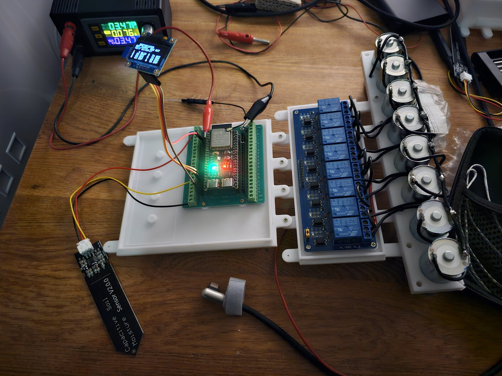

# BeetMeister

<!-- PROJECT LOGO -->
<br />
<div align="center">
  <a href="https://github.com/Mixermachine/BeetMeister">
    
  </a>

  <h3 align="center">BeetMeister</h3>

  <p align="center">
    A battery-powered ESP32-S3 irrigation controller with autonomous watering, Android BLE control, Home Assistant MQTT integration, and OTA firmware updates.
    <br />
    <a href="docs/architecture/project-overview.md"><strong>Read the project overview</strong></a>
    <br />
    <br />
    <a href="docs/architecture/system-architecture.md">Architecture</a>
    &middot;
    <a href="firmware/esp-idf/README.md">Firmware</a>
    &middot;
    <a href="app/README.md">Android App</a>
    &middot;
    <a href="hardware/README.md">Hardware</a>
  </p>
</div>

[](https://github.com/Mixermachine/BeetMeister/actions/workflows/ci-app.yml)
[](https://github.com/Mixermachine/BeetMeister/actions/workflows/ci-firmware.yml)

## Table Of Contents

- [About The Project](#about-the-project)
- [Current Status](#current-status)
- [Built With](#built-with)
- [Repository Layout](#repository-layout)
- [Getting Started](#getting-started)
- [Development](#development)
- [Documentation](#documentation)
- [Roadmap](#roadmap)

## About The Project

BeetMeister is an ESP32-S3-based irrigation controller for eight plant watering pairs. Each pair combines one capacitive soil-moisture sensor with one relay-controlled low-voltage pump, and the controller treats that pair as the basic unit for scheduling, telemetry, calibration, fault handling, and history.

The system is designed to remain useful even when external services are unavailable. Autonomous watering is the primary mission. The Android app and Home Assistant integration are control and visibility layers on top of that local controller behavior rather than prerequisites for it.

<p align="center">
  
</p>

<p align="center">
  Current prototype state with the partially assembled controller and printed 3D parts.
</p>

The documented v1 scope includes:

- Eight irrigation pairs
- LiFePO4 battery power with low-power and low-battery behavior
- Android BLE control with bonded-device access
- Home Assistant MQTT discovery and telemetry
- HTTP-based OTA firmware updates
- Persistent configuration, calibration, runtime state, and watering history

## Current Status

`Prototype / Work In Progress`

This repository already contains real firmware, Android app, hardware documentation, and CI pipelines, but the project is still in active development. The documentation is intentionally detailed and, in some areas, ahead of full end-to-end implementation.

Implemented foundations already present in the repo include:

- ESP-IDF firmware for the ESP32-S3 controller
- NimBLE-based custom BLE service for the Android app contract
- Kotlin + Compose Android app module
- Firmware host-side test suite and CI build
- Android unit-test and debug-build CI
- Hardware wiring, BOM, and Fritzing artifacts

## Built With

- [ESP-IDF](https://www.espressif.com/en/products/sdks/esp-idf) for firmware
- [NimBLE](https://mynewt.apache.org/latest/network/index.html) for BLE transport
- [Kotlin](https://kotlinlang.org/) and [Jetpack Compose](https://developer.android.com/jetpack/compose) for the Android app
- [Home Assistant MQTT](https://www.home-assistant.io/integrations/mqtt/) for supervisory integration
- [GitHub Actions](https://github.com/features/actions) for CI

## Repository Layout

- [`app/`](app/) Android application source code and app-specific notes
- [`firmware/`](firmware/) ESP-IDF firmware, host tests, and calibration support
- [`hardware/`](hardware/) electrical specs, wiring notes, BOM, and Fritzing artifacts
- [`docs/`](docs/) normative specifications, architecture, and planning docs
- [`integrations/`](integrations/) integration-specific contracts, currently Home Assistant MQTT
- [`scripts/`](scripts/) development and release helper scripts

## Getting Started

### Prerequisites

- Android Studio or a JDK 17-compatible Gradle environment for the app
- ESP-IDF 6.0 tooling for firmware work
- PowerShell for the provided firmware helper scripts

### Clone

```bash
git clone https://github.com/Mixermachine/BeetMeister.git
cd BeetMeister
```

### Build The Android App

```bash
cd app
./gradlew :app:assembleDebug
./gradlew :app:testDebugUnitTest
```

### Run Firmware Host Tests

```powershell
powershell -ExecutionPolicy Bypass -File .\scripts\dev\run-firmware-host-tests.ps1
```

### Build Firmware

Use the repo-local ESP-IDF wrapper workflow documented in [`firmware/esp-idf/README.md`](firmware/esp-idf/README.md). The firmware project root is `firmware/esp-idf`, and the wrapper scripts under [`.agents/skills/esp-idf-installation/`](.agents/skills/esp-idf-installation/) are the intended build, flash, and monitor entrypoints for this repo.

## Development

CI already verifies the main software slices:

- Android CI runs JVM unit tests and builds the debug APK
- Firmware CI runs host-side tests and an ESP-IDF firmware build
- Release workflow runs verification steps for tagged releases

For local development:

- start with [`docs/README.md`](docs/README.md) for the normative reading order
- use [`firmware/esp-idf/README.md`](firmware/esp-idf/README.md) for firmware build, flash, and monitor instructions
- use [`hardware/README.md`](hardware/README.md) for wiring, BOM, and Fritzing entry points

## Documentation

The most useful starting points for GitHub readers are:

- [`docs/architecture/project-overview.md`](docs/architecture/project-overview.md) for purpose, scope, and glossary
- [`docs/architecture/system-architecture.md`](docs/architecture/system-architecture.md) for runtime model and boundaries
- [`docs/specifications/requirements-baseline.md`](docs/specifications/requirements-baseline.md) for the v1 requirements baseline
- [`docs/specifications/ble-and-android-app.md`](docs/specifications/ble-and-android-app.md) for the Android BLE contract
- [`integrations/home-assistant/mqtt-specification.md`](integrations/home-assistant/mqtt-specification.md) for MQTT discovery, topics, and payloads
- [`firmware/esp-idf/README.md`](firmware/esp-idf/README.md) for the current firmware implementation slice

## Roadmap

The existing roadmap in [`docs/planning/milestone-roadmap.md`](docs/planning/milestone-roadmap.md) currently groups work into these major phases:

- `M1` electrical prototype and safe bench hardware validation
- `M2` core firmware logic, persistence, and scheduler behavior
- `M3` connectivity through MQTT, BLE, and the Android app
- `M4` OTA and release-candidate hardening
- deferred later milestones for BLE bond-admit hardening and a single-button local UI

<p align="right">(<a href="#beetmeister">back to top</a>)</p>
