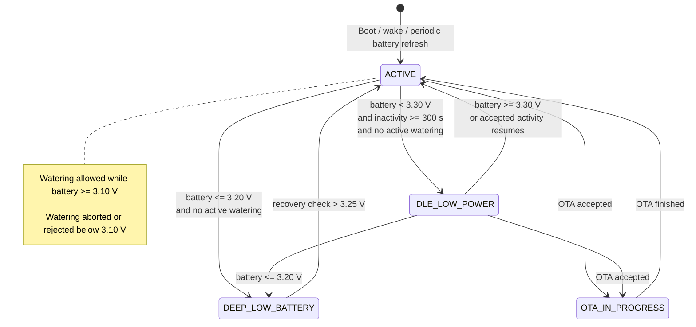

# BeetMeister Firmware Behavior Specification

## Scope

This specification defines normative controller behavior for boot, scheduling, watering, blocking, battery handling, sleep, persistence, and public state.

## Boot and initialization flow

On every cold boot, reset, OTA reboot, or wake from deep sleep, the controller shall execute the following sequence:

1. Set all relay outputs to off before enabling any pair state machine.
2. Read battery voltage and classify the device battery state.
3. Load application configuration from `appcfg`.
4. Load all per-pair calibration records from `appcfg`.
5. Load all per-pair runtime snapshots from `appcfg`.
6. Scan the `events` partition to reconstruct the highest valid event sequence number and next write slot.
7. Rebuild per-pair state from persisted runtime snapshots.
8. Decide whether to remain in deep low-battery behavior, active behavior, or idle-low-power awake behavior.
9. If awake behavior is allowed, initialize ADC, BLE, Wi-Fi, MQTT, and timers.
10. Publish or stream current controller and pair state once communications become available.
11. Run a scheduler cycle immediately when the wake reason is a scheduled check or when the next due check is missing or expired.

## Persistent state model

The controller shall persist the following data classes:

| Data class | Owner | Survives reset | Survives sleep | Survives OTA |
| --- | --- | --- | --- | --- |
| Application configuration | `appcfg` | Yes | Yes | Yes |
| Pair calibration | `appcfg` | Yes | Yes | Yes |
| Pair runtime snapshot | `appcfg` | Yes | Yes | Yes |
| Event ring | `events` | Yes | Yes | Yes |
| Wi-Fi and BLE stack-managed data | default `nvs` | Yes | Yes | Best effort by ESP-IDF |

Runtime snapshots shall be authoritative for:

- last known pair state
- block expiry
- most recent moisture reading and validity
- active manual or automatic run metadata that needs graceful recovery
- next scheduled check deadline

If a persisted snapshot indicates that a pair was watering before reset or power loss, the controller shall restore that pair with pump output off, clear any stale runtime state, and recover the pair to `IDLE` unless the pair is still sensor-invalid.

## Scheduler behavior

- The controller shall maintain one global scheduler interval of 7200 seconds.
- The next scheduler deadline shall be persisted before entering sleep.
- If the controller wakes after missing one or more deadlines, it shall run exactly one catch-up check cycle and then schedule the next deadline 7200 seconds later.
- A scheduler cycle shall inspect each enabled pair exactly once.
- Automatic evaluation order shall be ascending pair index.
- A pair that requires automatic watering shall move to `WAITING_FOR_SLOT` if no slot is free, otherwise it shall move directly to `SANITY_CHECK`.

## Moisture-to-duration decision rules

Automatic watering duration shall be derived from the measured moisture percentage using the following lookup:

| Moisture percent | Automatic action |
| --- | --- |
| 81 to 100 | No watering |
| 80 | 10 seconds |
| 70 to 79 | 60 seconds |
| 60 to 69 | 120 seconds |
| 50 to 59 | 180 seconds |
| 0 to 49 | 240 seconds |

The lookup shall use the integer moisture percentage after clamping and any required filtering.

## Pump concurrency rules

- No more than three pumps shall be active at one time.
- The concurrency limit applies equally to automatic and manual watering.
- When a slot becomes free, the oldest `WAITING_FOR_SLOT` pair by queue time shall be serviced first.
- A pair in `WAITING_FOR_SLOT` shall remain visible as waiting through MQTT and BLE.
- A queued manual request shall time out after 30 seconds if no slot becomes free and shall then return to `IDLE` with a command rejection result.

## Main valve behavior

- When the shared main valve feature is enabled, the controller shall treat the upstream ball valve as a global flow interlock.
- No pump may start until the valve is logically `OPEN`.
- Automatic watering, manual watering, automatic sanity-check, and manual moisture-response test shall all require the valve to open first.
- Relay test shall not move the valve.
- The valve shall be closed whenever no watering is active, except for a short configurable hold window between adjacent runs.
- Valve motion shall never overlap active pump output.
- The servo shall be powered only for short open and close actions and released after the configured move time.
- Manual valve open and close commands shall be rejected while watering is active, while the valve is already moving, when OTA is in progress, or when battery policy does not permit the action.

## Automatic sanity-check flow

The sanity check applies to automatic watering and to an operator-triggered moisture response test.

1. Capture a stable pre-run moisture percentage and voltage sample.
2. Start the pair pump.
3. Run the pump for 10 seconds.
4. Stop the pump long enough to capture a stable post-run moisture sample.
5. Compute `delta_pct = post_run_pct - pre_run_pct`.
6. If `delta_pct` is greater than 3.0 percentage points, accept the sensor response. Automatic watering continues with the remaining duration; a manual moisture response test returns the pair to `IDLE`.
7. If `delta_pct` is less than or equal to 3.0 percentage points, block the pair for 24 hours, record the event with stop reason `SENSOR_SANITY_FAILURE`, and do not continue watering.

The 10-second sanity run counts toward delivered pump time and shall be included in the event duration.
The remaining automatic watering duration after a successful sanity check is:

`remaining_duration = lookup_duration - 10 seconds`, with a minimum of 0 seconds.

## Pair state model

### Closed enum

The externally visible pair state enum is:

- `IDLE` (`IDLE`)
- `WAITING_FOR_SLOT` (`WAIT`)
- `SANITY_CHECK` (`SANI`)
- `WATERING` (`RUN`)
- `BLOCKED` (`BLKD`)
- `FAULT` (`FLT`)
- `MOISTURE_TEST` (`TEST`)

### Allowed transitions

| From | To | Condition |
| --- | --- | --- |
| `IDLE` (`IDLE`) | `WAITING_FOR_SLOT` (`WAIT`) | Accepted manual request or automatic watering request when no slot is free |
| `IDLE` (`IDLE`) | `SANITY_CHECK` (`SANI`) | Automatic request accepted and slot available |
| `IDLE` (`IDLE`) | `MOISTURE_TEST` (`TEST`) | Moisture response test request accepted and slot available |
| `IDLE` (`IDLE`) | `WATERING` (`RUN`) | Manual request accepted and slot available |
| `WAITING_FOR_SLOT` (`WAIT`) | `SANITY_CHECK` (`SANI`) | Automatic request receives a free slot |
| `WAITING_FOR_SLOT` (`WAIT`) | `WATERING` (`RUN`) | Manual request receives a free slot |
| `WAITING_FOR_SLOT` (`WAIT`) | `IDLE` (`IDLE`) | Request times out or is cancelled before pump start |
| `SANITY_CHECK` (`SANI`) | `WATERING` (`RUN`) | Automatic sanity check passes and remaining duration is greater than 0 |
| `SANITY_CHECK` (`SANI`) | `IDLE` (`IDLE`) | Automatic sanity check passes and remaining duration is 0 |
| `SANITY_CHECK` (`SANI`) | `BLOCKED` (`BLKD`) | Automatic sanity check fails |
| `SANITY_CHECK` (`SANI`) | `FAULT` (`FLT`) | Sensor or battery failure makes continuation unsafe |
| `MOISTURE_TEST` (`TEST`) | `IDLE` (`IDLE`) | Moisture response test passes |
| `MOISTURE_TEST` (`TEST`) | `BLOCKED` (`BLKD`) | Moisture response test fails |
| `MOISTURE_TEST` (`TEST`) | `FAULT` (`FLT`) | Sensor or battery failure makes continuation unsafe |
| `WATERING` (`RUN`) | `IDLE` (`IDLE`) | Duration completes normally or manual run is stopped cleanly |
| `WATERING` (`RUN`) | `BLOCKED` (`BLKD`) | Sensor fault during automatic run escalates to a safety block |
| `WATERING` (`RUN`) | `FAULT` (`FLT`) | Low battery, relay fault suspicion, or invalid runtime state aborts the run |
| `BLOCKED` (`BLKD`) | `IDLE` (`IDLE`) | Block expires or operator resets the block |
| `FAULT` (`FLT`) | `IDLE` (`IDLE`) | Operator reset or subsequent valid startup recovers the pair |

No other transitions are permitted.

## Manual watering behavior

- A manual start command shall use the same moisture and battery safety gates as automatic watering except that it shall not perform the 10-second sanity check.
- Manual watering default duration shall equal the current automatic lookup duration for that pair, with a minimum of 10 seconds when the lookup would otherwise be 0.
- A manual start command may instead provide an explicit requested duration from 1 through 1200 seconds, which shall override the default manual duration for that accepted run only.
- A manual stop command shall terminate active watering immediately and record stop reason `MANUAL_STOP`.
- Manual start on a blocked or faulted pair shall be rejected.

## Block and unblock rules

### Block reasons

The block reason enum is closed and shall be one of:

- `NONE`
- `MOISTURE_RESPONSE_TEST_FAILED`
- `SENSOR_READING_INVALID`
- `LOW_BATTERY_ABORT`

Exact meanings:

| Block reason | Meaning |
| --- | --- |
| `NONE` | Pair is not currently blocked. |
| `MOISTURE_RESPONSE_TEST_FAILED` | A 10-second automatic sanity check or manual moisture response test completed but moisture increase was less than or equal to 3 percentage points. |
| `SENSOR_READING_INVALID` | Sensor reading was electrically implausible, missing, or disconnected during an automatic safety evaluation. |
| `LOW_BATTERY_ABORT` | An active watering run was aborted because battery voltage fell below the watering threshold. |

### Unblock conditions

- A 24-hour sensor block shall expire automatically when the current UTC time is known and has passed the expiry time.
- If UTC time is not known, the controller shall track block age by elapsed sleep and awake durations and shall expire the block after 24 hours of accumulated elapsed time.
- An operator reset through MQTT or BLE shall clear `BLOCKED` immediately and shall clear `FAULT` when the sensor is valid.
- Clearing an error shall not erase calibration, history, or the last fault counters.

## Error handling and fail-safe rules

- Invalid sensor readings shall place the pair in `FAULT` and shall prevent watering.
- A sensor reading is invalid when the ADC conversion fails, the filtered voltage is outside the electrically plausible range, or the measurement is missing after two retry attempts.
- The controller shall not reinterpret invalid or missing data as dry soil.
- A suspected disconnected sensor shall use block reason `SENSOR_READING_INVALID` if detected during an automatic sanity check, otherwise it shall place the pair in `FAULT`.
- If battery voltage drops below 3.10 V while watering, the controller shall stop that watering run immediately and record stop reason `LOW_BATTERY_ABORT`.
- If relay command feedback is not available in hardware, relay fault detection in v1 shall be limited to command-state inconsistency and impossible state recovery after reset.
- A pump command shall be rejected before activation when the pair is `BLOCKED` or `FAULT`, when battery policy forbids watering, when no concurrency slot becomes available before timeout, or when OTA is in progress.

## Battery state machine

### Closed enum

- `ACTIVE`
- `IDLE_LOW_POWER`
- `DEEP_LOW_BATTERY`
- `OTA_IN_PROGRESS`

### Power-check state machine

Power-check interpretation:

- The controller samples battery voltage during boot and during the main control loop.
- In the current firmware implementation, the main control loop samples battery voltage about once per second.
- `ACTIVE` is the normal awake state.
- `IDLE_LOW_POWER` is selected only when battery voltage is below `3.30 V`, inactivity has reached `300 s`, and no watering run is active.
- `DEEP_LOW_BATTERY` is selected when idle battery voltage is less than or equal to `3.20 V`.
- Recovery from `DEEP_LOW_BATTERY` requires a later battery check above `3.25 V`.
- `IDLE_LOW_POWER` uses timer-plus-button light sleep in the current implementation.
- `DEEP_LOW_BATTERY` uses timer-only deep sleep in the current implementation.
- Watering is allowed only while battery voltage is at least `3.10 V`; below that level, runs are aborted or new runs are rejected.
- `OTA_IN_PROGRESS` suppresses scheduler entry and watering regardless of battery state classification.

Current implementation note:

- The firmware already performs battery-state classification using these thresholds.
- The implemented battery refresh cadence is approximately `1 Hz` while the controller loop is awake.
- The OLED display follows the controller power state and turns off in `IDLE_LOW_POWER` and `DEEP_LOW_BATTERY`.
- While a BLE central is connected, the OLED top-right corner shall show a small Bluetooth indicator. A small wave next to the indicator shall blink briefly after GATT traffic, including protected reads, writes, state notifications, and command-result indications.
- Wi-Fi and BLE stop/start are centralized at the sleep transition hooks, but remain no-op stubs until those transports are implemented in firmware.
- `DEEP_LOW_BATTERY` recovery checks use an adaptive interval of 1 hour for the first 3 failed checks, 2 hours for the next 6 failed checks, and 4 hours thereafter until recovery.

### Thresholds

| Condition | Threshold |
| --- | --- |
| Enter deep low-battery behavior | Idle battery voltage less than or equal to 3.20 V |
| Exit deep low-battery behavior | Recovery-check voltage greater than 3.25 V |
| Enter idle low-power sleep | Awake battery voltage below 3.30 V with 5 minutes of inactivity and no active watering |
| Continue active watering | Battery voltage greater than or equal to 3.10 V |
| Abort or reject watering | Battery voltage below 3.10 V |

### Behavior

- `ACTIVE` permits MQTT and BLE operation, scheduler execution, and watering.
- `IDLE_LOW_POWER` preserves persisted state and next scheduler deadline, turns the OLED off, and enters light sleep with timer and `GPIO13` button wake.
- `DEEP_LOW_BATTERY` keeps relay outputs off, turns the OLED off, and enters deep sleep for adaptive timer-based recovery checks.
- `OTA_IN_PROGRESS` suppresses scheduler entry and rejects manual watering until the OTA attempt finishes.

## Sleep and wake policy

- The inactivity timer for `IDLE_LOW_POWER` shall reset on any accepted MQTT or BLE write command.
- Read-only telemetry requests shall not reset the inactivity timer.
- The controller shall wake for one of: scheduled check deadline, adaptive deep-low-battery recovery check, `GPIO13` button wake from idle low-power sleep, reset, or OTA reboot.
- When communications are unavailable after wake, the controller shall still execute scheduler and safety logic.
- Before entering any sleep mode, the controller shall persist next scheduler deadline and all pair runtime snapshots.

## Public data models

### Persistent configuration schema

| Field | Type | Meaning |
| --- | --- | --- |
| `schema_version` | `u16` | Configuration record format version |
| `device_id` | `string[24]` | Stable device identity used in MQTT and BLE |
| `pair_count` | `u8` | Fixed to 8 in v1 |
| `watering_interval_s` | `u32` | Fixed default 7200 |
| `idle_sleep_threshold_mv` | `u16` | Default 3300 |
| `deep_sleep_threshold_mv` | `u16` | Default 3200 |
| `deep_sleep_resume_mv` | `u16` | Default 3250 |
| `watering_abort_threshold_mv` | `u16` | Default 3100 |
| `inactivity_sleep_timeout_s` | `u16` | Default 300 |
| `mqtt_broker_host` | `string[64]` | Broker hostname or IP |
| `mqtt_broker_port` | `u16` | Broker port |
| `mqtt_username` | `string[32]` | Optional username |
| `mqtt_password` | `string[64]` | Optional password |
| `mqtt_base_topic` | `string[48]` | Base topic namespace |
| `ota_base_url` | `string[96]` | HTTP endpoint or base path |
| `time_valid` | `bool` | Last persisted time-valid flag |

### Calibration data model per sensor

| Field | Type | Meaning |
| --- | --- | --- |
| `pair_index` | `u8` | Pair number 1 through 8, or `0` for controller sleep events |
| `dry_mv` | `u16` | Dry reference in millivolts |
| `wet_mv` | `u16` | Wet reference in millivolts |
| `calibrated_at_unix_s` | `u32` | UTC time of calibration, 0 if unknown |
| `source` | `enum` | `DEFAULT` or `USER` |

### Pair runtime persisted snapshot

| Field | Type | Meaning |
| --- | --- | --- |
| `pair_index` | `u8` | Pair number 1 through 8 |
| `pair_state` | `enum` | Current public pair state |
| `last_moisture_pct` | `u8` | Last valid percentage |
| `last_sensor_mv` | `u16` | Last valid sensor voltage |
| `sensor_valid` | `bool` | Whether last reading was valid |
| `block_reason` | `enum` | `NONE`, `MOISTURE_RESPONSE_TEST_FAILED`, or `SENSOR_READING_INVALID` |
| `block_until_unix_s` | `u32` | UTC expiry, 0 if not blocked or time unknown |
| `block_remaining_s` | `u32` | Remaining elapsed-time block countdown when UTC is unknown |
| `active_run_id` | `u32` | Non-zero only when a run was in progress before persistence |
| `active_run_source` | `enum` | `NONE`, `AUTOMATIC`, `MANUAL`, `TEST` |
| `run_started_unix_s` | `u32` | UTC start time, 0 if unknown |
| `run_elapsed_s` | `u16` | Elapsed run duration at snapshot time |
| `run_target_s` | `u16` | Total requested duration |
| `next_check_due_unix_s` | `u32` | UTC deadline if time is valid |
| `next_check_due_in_s` | `u32` | Relative deadline for sleep recovery when time is not valid |

### Watering event schema

The watering event ring stores only watering outcomes. Controller lifecycle events such as sleep and BLE transitions belong to the separate system-event ring.

| Field | Type | Meaning |
| --- | --- | --- |
| `schema_version` | `u8` | Event record format version |
| `seq_no` | `u64` | Monotonic sequence number |
| `boot_id` | `u32` | Monotonic boot identifier for the controller boot that created the event |
| `pair_index` | `u8` | Pair number 1 through 8 |
| `trigger_source` | `enum` | `AUTOMATIC` or `MANUAL` |
| `started_at_unix_s` | `u32` | UTC start time, 0 if unknown |
| `ended_at_unix_s` | `u32` | UTC end time, 0 if unknown |
| `time_valid` | `bool` | Whether wall-clock timestamps are valid |
| `moisture_before_pct` | `u8` | Moisture before run |
| `moisture_after_pct` | `u8` | Moisture after run or last valid reading |
| `sensor_before_mv` | `u16` | Voltage before run |
| `sensor_after_mv` | `u16` | Voltage after run or last valid reading |
| `requested_duration_s` | `u16` | Requested total duration |
| `actual_duration_s` | `u16` | Actual pump-on duration |
| `stop_reason` | `enum` | Closed stop-reason enum |
| `block_reason` | `enum` | Closed block-reason enum or `NONE` |
| `battery_start_mv` | `u16` | Battery voltage at run start |
| `battery_end_mv` | `u16` | Battery voltage at run end |
| `started_uptime_s` | `u32` | Monotonic uptime at run start |
| `ended_uptime_s` | `u32` | Monotonic uptime at run end |

### Stop reasons

The stop reason enum is closed and shall be one of:

- `COMPLETED`
- `MANUAL_STOP`
- `LOW_BATTERY_ABORT`
- `SENSOR_SANITY_FAILURE`
- `SENSOR_INVALID_ABORT`
- `SYSTEM_ABORT`
- `IDLE_LOW_POWER_SLEEP`
- `DEEP_LOW_BATTERY_SLEEP`
- `IDLE_LOW_POWER_SLEEP`
- `DEEP_LOW_BATTERY_SLEEP`

Exact meanings:

| Stop reason | Meaning |
| --- | --- |
| `COMPLETED` | Requested run duration finished normally. |
| `MANUAL_STOP` | Operator-issued stop ended an active run. |
| `LOW_BATTERY_ABORT` | Run stopped because battery voltage fell below the watering threshold. |
| `SENSOR_SANITY_FAILURE` | Automatic run stopped after the mandatory pre-run delta check failed. |
| `SENSOR_INVALID_ABORT` | Run stopped because sensor data became invalid during the safety path. |
| `SYSTEM_ABORT` | Run stopped because of reset, OTA transition, or unrecoverable controller error. |
| `IDLE_LOW_POWER_SLEEP` | Controller entered idle low-power sleep after inactivity or low battery policy allowed light sleep. |
| `DEEP_LOW_BATTERY_SLEEP` | Controller entered deep sleep because battery voltage fell below the deep-low threshold. |

## Time-handling rules

- Durations, queue ages, and inactivity timers shall use monotonic time.
- Persisted ordering of watering events shall use `seq_no`, not timestamps.
- UTC timestamps shall be used only when the controller has a valid time source.
- Every persisted watering or system event shall always carry both `boot_id` and uptime fields.
- Successful real valve motion shall be persisted as system events:
  - `VALVE_OPENED`
  - `VALVE_CLOSED`
- Calibration preview moves shall not be persisted as system events.
- When UTC time is unavailable, Unix event timestamps shall be recorded as `0` and `time_valid = false`.
- When UTC becomes valid during the current boot, the controller shall backfill unresolved records from the same `boot_id`.
- Unresolved records from older boots shall be ignored by history readout.
- MQTT and BLE payloads shall expose whether wall-clock time is currently valid.
